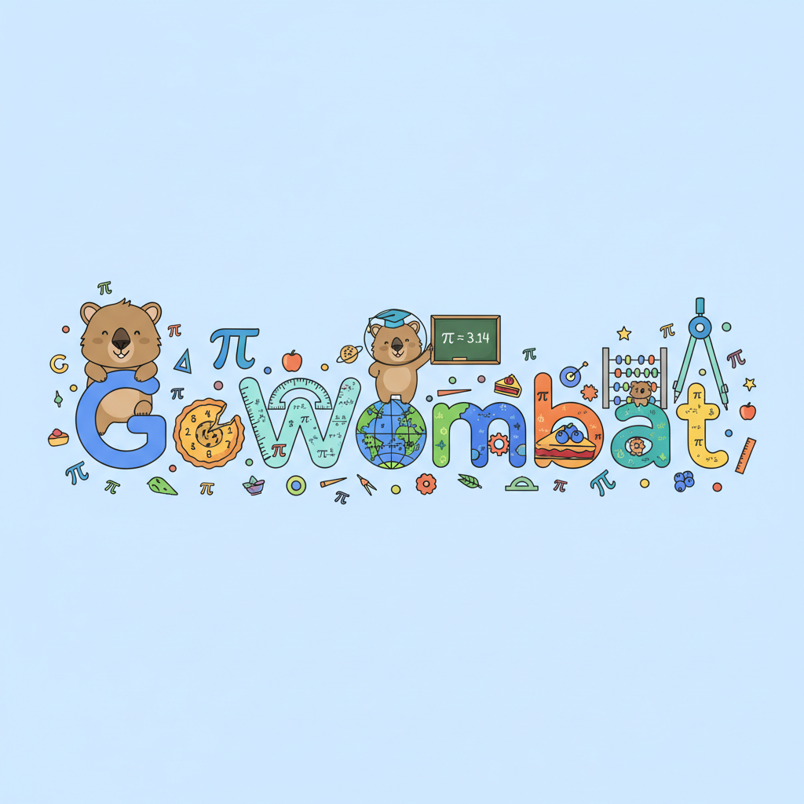
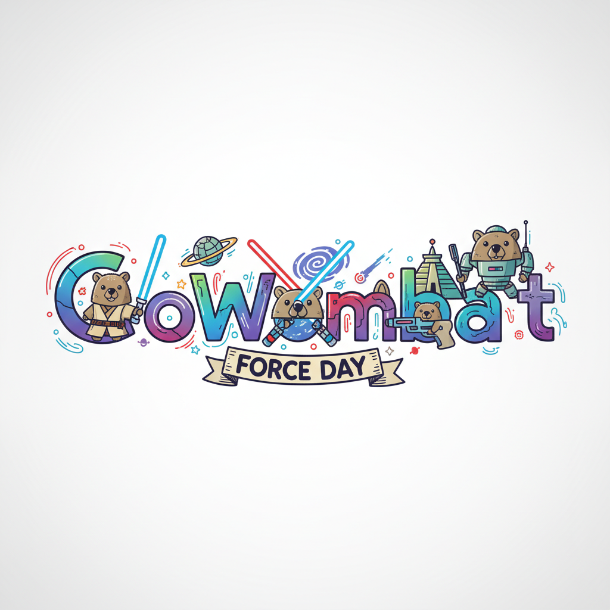
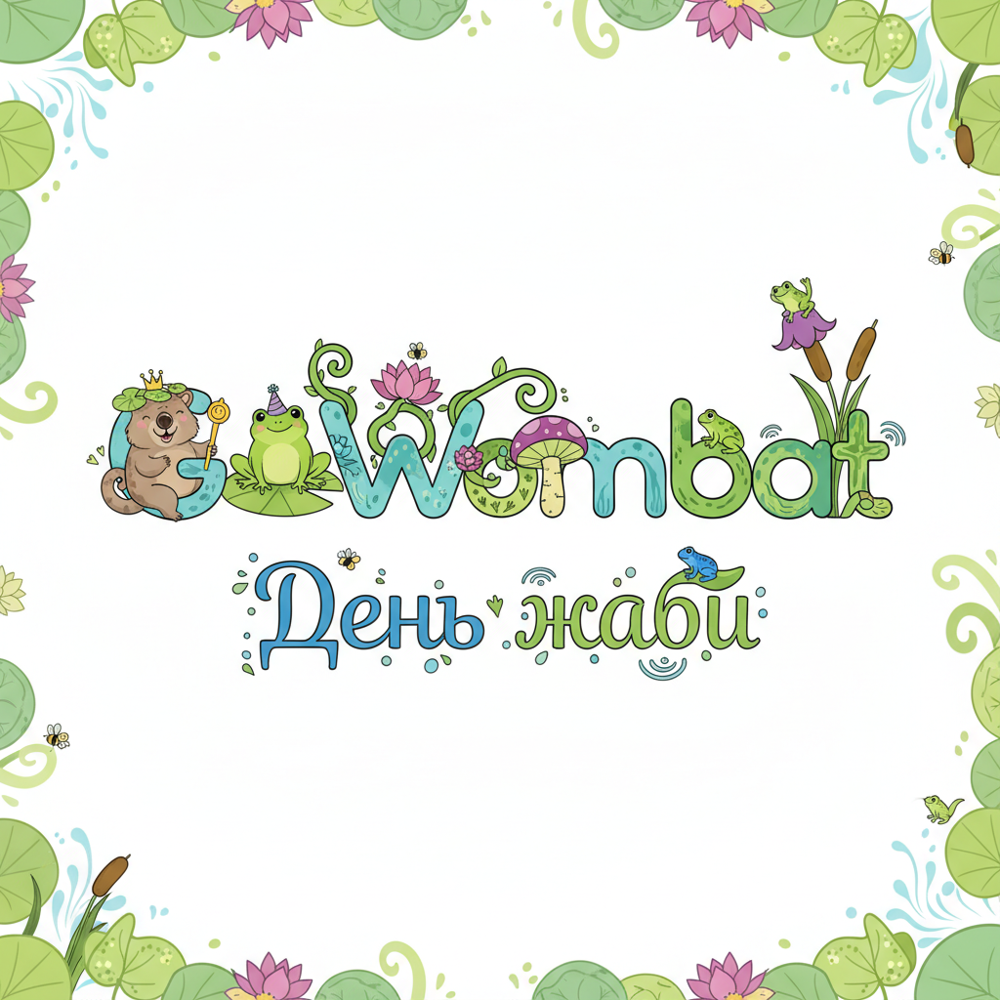
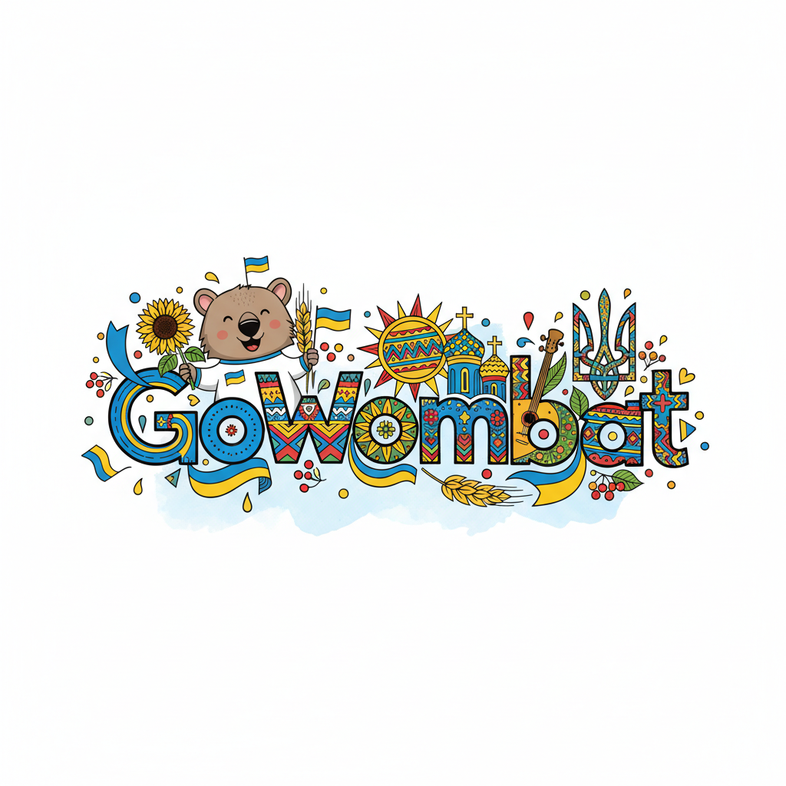

# GoWombat Doodles Generator 🎨

AI-powered creative doodle generator in Google Doodles style for GoWombat company.

## ✨ Features

- 🌍 **Multi-language Support** - English, Russian, and Ukrainian
- 🎨 **AI-Powered Generation** - Uses Gemini 2.5 Flash Image Preview  
- ⚡ **Fast Generation** - Results in 5-10 seconds
- 💾 **Download Support** - Save as PNG format
- 🐳 **Docker Ready** - One-command deployment

## 🎭 Demo Gallery

Here are some amazing doodles generated by GoWombat Doodles Generator:

### Pi Day Celebration 🥧
**Prompt**: "Day of Pi number"

*Mathematical symbols and wombats celebrating the famous mathematical constant π*

### Star Wars Day 🌟
**Prompt**: "Force Day"

*Wombats wielding lightsabers in a galaxy far, far away*

### Frog Day 🐸
**Prompt**: "День жаби" (Ukrainian: "Day of the Frog")

*Nature-themed doodle with frogs and pond lilies*

### Ukraine Independence Day 🇺🇦
**Prompt**: "День незалежності України" (Ukrainian: "Ukraine Independence Day")

*Patriotic celebration with Ukrainian symbols and colors*

## 🚀 Quick Start

```bash
# 1. Clone the repository
git clone <repository_url>
cd nano_banana

# 2. Configure environment
cp .env.example .env
# Add your OPENROUTER_API_KEY to .env file

# 3. Launch application
docker-compose up --build -d

# 4. Open in browser
open http://localhost:8000
```

## 🎯 How to Use

1. **Enter an occasion** (e.g., "Programmer's Day", "Christmas", "Новий рік")
2. **Add style hints** (optional: "minimalist", "colorful", "vintage")  
3. **Get your doodle** and download the result!

## 📚 Documentation

| Document | Description |
|----------|-------------|
| 📖 **[docs/README.md](docs/README.md)** | Complete project documentation |
| 🔧 **[docs/API.md](docs/API.md)** | REST API reference |
| 🚢 **[docs/DEPLOYMENT.md](docs/DEPLOYMENT.md)** | Deployment guide |
| 💻 **[docs/DEVELOPMENT.md](docs/DEVELOPMENT.md)** | Developer guide |
| 🗂️ **[docs/INDEX.md](docs/INDEX.md)** | Documentation navigation |

## ⚙️ Configuration

Essential variables in `.env`:

```env
# Required
OPENROUTER_API_KEY=your_api_key_here

# Optional  
DEBUG=false
RATE_LIMIT_REQUESTS=10
IMAGE_GENERATION_TIMEOUT=60
```

## 🔍 API

**Generate doodle:**
```bash
curl -X POST http://localhost:8000/api/generate-doodle \
  -H "Content-Type: application/json" \
  -d '{"occasion": "Birthday party", "style_hint": "festive"}'
```

**Documentation:** http://localhost:8000/docs

## 🛠️ Development

```bash
# Backend development
cd backend
python -m venv venv
source venv/bin/activate
pip install -r requirements.txt
uvicorn app.main:app --reload

# Testing
pytest tests/
```

## 🐳 Project Structure

```
nano_banana/
├── backend/           # Python/FastAPI server
├── frontend/          # Web interface  
├── docs/             # 📚 Complete documentation
├── samples/          # 🎭 Demo gallery images
├── docker-compose.yml # Docker configuration
└── .env.example      # Configuration template
```

## 🌟 Example Use Cases

- **Corporate Events**: Company anniversaries, product launches
- **Holidays**: Christmas, New Year, Easter, Halloween
- **Special Days**: International days, awareness campaigns  
- **Cultural Events**: National holidays, festivals
- **Tech Events**: Programmer's Day, Pi Day, Star Wars Day
- **Custom Celebrations**: Any occasion in any language!

## 🆘 Support

- **Issues**: Create an Issue in the repository
- **API Documentation**: http://localhost:8000/docs  
- **Detailed Documentation**: [docs/INDEX.md](docs/INDEX.md)

## 📄 License

MIT License - see details in [docs/README.md](docs/README.md)

---

🎨 **Create amazing GoWombat doodles with AI power!**